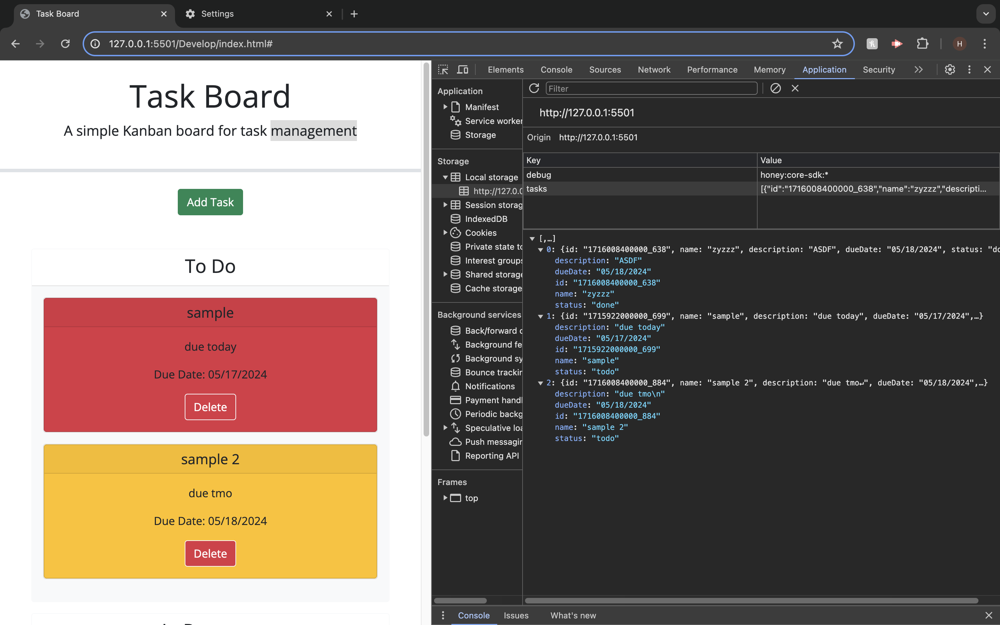
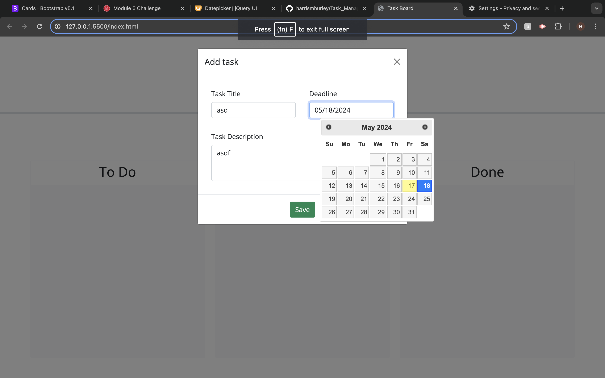
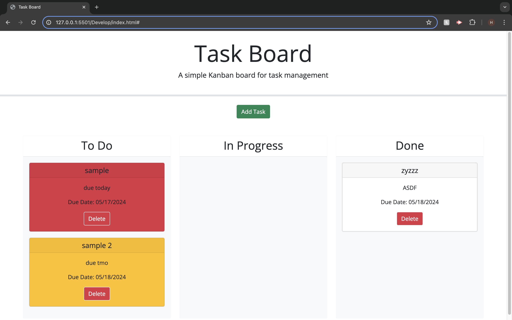

# Task_ManagerHQ
    

 - Add validation to ensure that tasks have valid titles, descriptions, and due dates before saving. 
 
 - Implement error handling for user input and potential issues with local storage operations.

 - Ensure consistency in naming conventions. For instance, use either camelCase or snake_case throughout the code. 

 - Reduce duplication in the modal body by creating a function to generate form elements. This will make the code cleaner and easier to maintain. 

 - Separate concerns by moving task-related logic to a dedicated module or file, rather than keeping everything in a single script file. 

 - Add more comments and documentation to explain the purpose and functionality of key code sections, making it easier for others (and future you) to understand. 

 - The draggable and droppable functionality with a few improvements, particularly in validation, error handling, and code organization, your task board will meet the assignment criteria

## Description

The Task Manager Application is a web-based tool designed to help you organize and manage your tasks effectively. With this application, you can create, update, and track tasks with ease, allowing you to stay on top of your responsibilities and improve your productivity.

## Deployed Application URL

[Task_ManagerHQ](https://harrismhurley.github.io/Task_ManagerHQ/)

## Table of Contents
* [Installation](#installation)
* [Usage](#usage)
* [Credits](#credits)
* [Features](#features)
* [Screenshots](#screenshots)
* [How to Contribute](#how-to-contribute)
* [License](#license)

## Installation

N/A

## Usage
1. Creating a Task:
    - Click on the "Add Task" button to open the task creation modal.
    - Enter the task details, including title, description, and due date.
    - Click "Save" to add the task to the list.

2. Updating Task Status:
    - Drag a task card from one status lane to another to update its status.
    - Tasks can be moved between "To Do," "In Progress," and "Done" lanes.

3. Deleting a Task:
    - Click on the "Delete" button on a task card to remove it from the list.

## Credits

[Xander Rapstine](https://github.com/Xandromus)
[Michael McEwen](https://github.com/mcewball13)

## Features

- Task Creation: Easily create new tasks with a title, description, and due date.
- Task Status Tracking: Track the status of each task, including "To Do," "In Progress," and "Done."
- Drag-and-Drop Interface: Intuitive drag-and-drop interface for moving tasks between different status lanes.
- Task Deletion: Remove tasks from the list when they are no longer needed.
- Responsive Design: The application is responsive and works seamlessly regardless of window size.
- Data Persistence: Tasks are saved locally using browser storage, ensuring that your task list is preserved even when you close the browser.

## Screenshots

## How to Contribute
If you would like to contribute you can contact me [Via Email](mailto:harrismhurley@icloud.com?subject=[GitHub]%20Dev%20Connect) or visit [github](https://github.com/harrismhurley).

## License 
This project is licensed under the [MIT](https://opensource.org/licenses/MIT) license.

